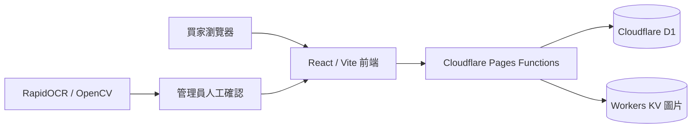

# Zhuの小舖

一個以實際營運需求打造的《傳說對決》帳號展示賣場。買家可以瀏覽、搜尋、依價格篩選並查看完整帳號圖片；管理端則提供批量上傳、價格辨識、上架與刪除。

[](LICENSE)

> 這是展示型網站，不處理付款、購物車、會員、站內聊天、交易撮合或帳號保管。

## 專案亮點

- **電商式商品牆**：手機 2 欄、平板 3 欄、桌面 4 欄，支援搜尋、價格範圍、排序、分頁與返回狀態保存。
- **完整圖片體驗**：列表與詳情皆保持原比例，支援全螢幕放大，避免裁切遊戲帳號資訊。
- **可靠批量上傳**：分批註冊、限制並行數、失敗重試與進度回饋，避免大量圖片長時間卡住。
- **跨裝置管理**：商品資料存於 D1、圖片存於 KV，手機與電腦共用同一份狀態。
- **安全以圖刪除**：先比對 SHA-256，再以感知指紋容忍壓縮與縮放；只有唯一可信結果才能刪除。
- **通用價格辨識**：RapidOCR + OpenCV，多種影像前處理；低信心結果保留人工確認。
- **雲端單一資料來源**：商品資料只存 Cloudflare D1，商品圖片只存 Cloudflare KV；不同裝置共用同一份狀態。
- **瀏覽器不留商品資料**：瀏覽器只保留暫時登入 session 與篩選畫面狀態，不建立商品資料庫或圖片副本。
- **隱私優先**：管理員密碼使用 PBKDF2 加鹽雜湊；本機路徑、帳號資料、憑證、OCR 報告與正式商品資料不進 Git。

## 系統架構



## 技術棧

| 區域 | 技術 |
| --- | --- |
| 前端 | React 19、Vite、Tailwind CSS、Lucide、Simple Icons |
| 後端 | Cloudflare Pages Functions |
| 資料 | Cloudflare D1、Workers KV |
| 圖片比對 | SHA-256、64-bit 感知指紋 |
| OCR | Python、RapidOCR、ONNX Runtime、OpenCV |
| 品質 | Node Test Runner、Oxlint、GitHub Actions |

## 本機啟動

需求：Node.js 24+。

```bash
npm install
npm run dev
```

驗證完整專案：

```bash
npm test
npm run lint
npm run build
```

## Cloudflare 部署

1. 複製 `wrangler.example.toml` 為 `wrangler.toml`。
2. 建立自己的 D1 與 KV，填入資源 ID。
3. 套用 migrations。
4. 在 `/admin` 建立管理員帳號並設定聯絡方式。
5. 建置並部署 Pages。

```bash
npx wrangler d1 migrations apply YOUR_DATABASE --remote
npm run build
npx wrangler pages deploy dist --project-name YOUR_PROJECT
```

## 自動化工具

```bash
# 管理商品
npm run admin -- list
npm run admin -- status --id PRODUCT_ID --status available

# 建立離線 OCR 環境並掃描
npm run prices:setup
$env:AOV_IMAGE_DIR = 'C:\\path\\to\\images'
npm run prices:scan -- --workers 4
```

CLI 只從環境變數讀取連線資訊。請先參考 `.env.example`，不要提交實際密碼或 token。

## 主要目錄

```text
src/                         前台、詳情頁、後台與互動元件
functions/api/               Cloudflare Pages Functions API
functions/_lib/              驗證、稽核、商品與圖片共用邏輯
migrations/                  D1 schema 與版本遷移
scripts/price-recognition/   離線 OCR 與價格候選排序
test/                        API、辨識與圖片比對測試
```

## 隱私與授權

公開倉庫不包含正式商品、買家資料、本機路徑、Cloudflare 資源 ID、管理員帳密或同步狀態。現行網站不連接本機資料夾、供應商分類或本機帳號資料庫；安全問題請依 [SECURITY.md](SECURITY.md) 私下回報。

專案原始碼採 [MIT License](LICENSE)。第三方視覺概念與影片素材授權詳見 [THIRD_PARTY_NOTICES.md](THIRD_PARTY_NOTICES.md)。
